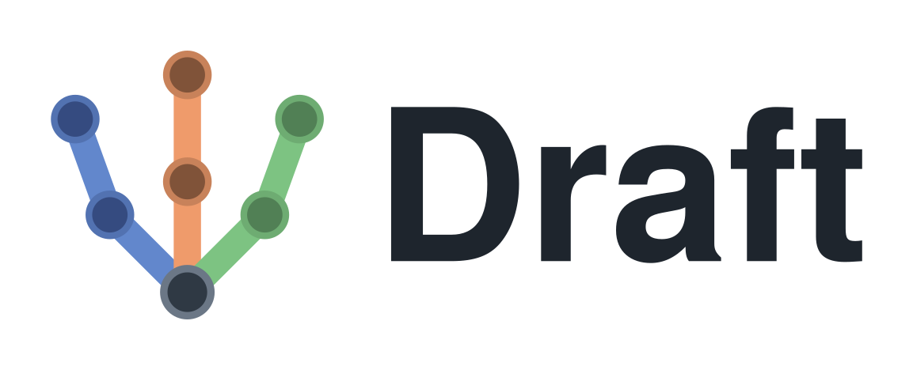

<p align="center">
  
</p>

<p align="center"><em>A parametric tool for robot design exploration</em></p>

<p align="center">
  <a href="https://arxiv.org/pdf/2609.38405">Paper (arXiv)</a> ·
  <a href="https://youtu.be/egzlEqfwwLU">Video</a>
</p>

[](https://youtu.be/egzlEqfwwLU)

Draft compiles a short declarative robot description into a simulation-ready
MuJoCo model, without CAD. You state link lengths and the torque and speed each
joint needs. Trends fitted to 114 catalogued actuators and 49 published robot
descriptions fill in the masses, motor sizes and reflected inertias, then check
whether the assembled machine could be built. Design variants take seconds to
generate, and every one can be trained with the included quadruped RL tasks.

## Quick start

```shell
conda env create -f environment.yml && conda activate draft
export PYTHONNOUSERSITE=1          # keep ~/.local packages out of the env
pip install -e ".[editor,twins,figures,dev]" -c constraints.txt
python scripts/robot_tuner.py                       # browser editor
python scripts/generate_robot.py --robot quadruped  # headless, writes generated/
```

Training needs a CUDA GPU: add the `rl` extra (`pip install -e ".[rl]" -c
constraints.txt`) and see [`docs/tasks.md`](docs/tasks.md).
Everything else runs on a laptop CPU.

## Layout

```
src/draft/
  generation/   the compiler: parameter table + kinematic tree -> MJCF
  trends/       fitted trends, the feasibility checks, and their coefficients
  robots/       the shipped specifications (humanoid, quadruped)
  twins/        four Unitree robots rebuilt from specs and scored
  tasks/        quadruped locomotion environments and curricula
  lineup/       the paper's training and evaluation sweep
  editor/       the browser editor
datasets/       actuator catalogue and robot-description survey, with fitting scripts
experiments/    design variants, sweep spec, frozen results
scripts/        command-line entry points and figure scripts
tests/          pytest; --runslow adds the twin rebuilds
```

Vendor robot models are not included. `python scripts/setup_data.py` fetches
them. The full documentation is in [`docs/`](docs/README.md).

## Citing

See [`CITATION.cff`](CITATION.cff).

## License

MIT, see [LICENSE](LICENSE). Fetched vendor descriptions keep their own
licences.
