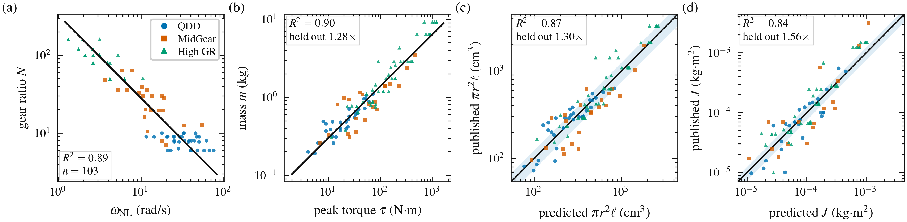

# The fitted trends, and what they refuse

`src/draft/trends/feasibility.py` owns the trends fitted in `datasets/` and the
checks they imply. Every generated robot is sized and vetted by it; a design
cannot opt out.

The fits are **trends**: regressions over a finite sample of real hardware, not
statements about what is physically possible. What the pipeline does with them
is a **feasibility check** (`FeasibilityViolation`, `feasibility_report.yaml`).
The one physical law in the chain is the airgap relation `τ_rotor ∝ r²L`.

*The four actuator relations against the 114 catalogued modules. Black lines
are the fits, blue bands ±25%.*

## What you state, and what is derived

**You state** link lengths, and any **two** of an actuator class's peak torque,
no-load speed, gear ratio (`<cls>_motor_gear`) and peak power
(`<cls>_motor_power`). Optionally `<cls>_motor_aspect`. Gearbox friction and
damping are also stated, because no trend covers them.

**Derived, and cannot be set:**

- Actuator mass, volume, radius, length, effective density and `armature`.
- Every structural member's mass and radius, from its class's structural trend
  (`link_mass_class`: thigh, shank, upper arm, forearm, hip link, and so on).
- Segment densities the population has measured (`head_rho`, `hand_rho`,
  `foot_rho`, `thigh_rho`, …) and the trunk density (`torso_rho`: humanoid
  716 kg/m³, n=13; quadruped 654 kg/m³, n=20).

A value stated for any of these is ignored and recorded under
`overridden_by_law` / `segment_densities` in the report. The key still has to be
declared, because its name says the body exists.

## Actuators

- **Mass:** `m = 0.0653·τ^0.666` kg (R²=0.90, n=103). A gear term was fitted at
  −0.021 ± 0.034 and dropped as indistinguishable from zero; the two-variable fit
  ships under `gear_term_dropped` for comparison.
- **Volume** follows the airgap relation `τ/N = 2π·σ_eff·r²L`. The `r²L` form is
  imposed; only the shear stress is fitted,
  `σ_eff = 11974·τ^0.300·N^-0.833` Pa (R²=0.84). Held out, radius predicts to
  1.12× and length to 1.14×.
- **Shape.** The airgap relation fixes `r²L` but not its split. The default is
  the catalogue's `L/D = 0.401·τ^-0.098·N^+0.316` (R²=0.64); state
  `<cls>_motor_aspect` to override it. Outside the catalogue's range (0.28–1.69)
  the class gets a warning.
- **Armature** is `N²·J` with `J = 27.2·r⁴` (R²=0.87, n=88). It is the loosest
  number the generator emits: **1.56×** held out, because the package radius is
  the housing's and no vendor says whether the motor is an inrunner or an
  outrunner.
- **Which two** quantities a class states is `<cls>_motor_mode`: `torque_speed`
  (default), `torque_gear`, `power_gear` or `power_torque`. The others are
  solved, with speed tied to reduction by `ω = 228.5·N^-0.938`.
- **Anchoring.** `_<cls>_motor_catalog: <part>` anchors a class on a catalogued
  actuator, so it inherits that part's measured mass and envelope and the trend
  charges only the deviation. State the reduction too.

## Links and trunk

- **Two populations, never mixed.** `mass_composition_reference: humanoid |
  quadruped` selects which population every band comes from. The humanoid trend
  prices a quadruped thigh at 2.1× its real mass, so they must stay separate.
  Size is measured per population via `size_metric_expr` (humanoid: vertical
  joint span; quadruped: thigh + shank).
- **Members stop at the actuator face**, plus a 5 mm bolt flange
  (`link_motor_penetration`), at both ends, so no volume is charged twice.
  `link_motor_inset: false` disables this.
- **Drawn width.** A member is drawn no wider than the actuators at either end
  (`generation/tree_ops.py:drawn_radius`), scaled by `link_render_radius_scale`
  (default 1.0; the base quadruped draws at 0.70). Density is adjusted so no mass moves.
- **Trunk.** `torso_rho` is the population's measured trunk density, applied so
  the body weighs `ρ × V_box`. Battery, compute and wiring are already inside
  that measurement.
- **Actuator insets.** `shoulder_motor_inset` (humanoid) and `hip_roll_inset`
  (quadruped) set how far a limb's first actuator sits inside the trunk.
- **Decorative geoms** (`decorative: true`) are weightless and non-colliding.
- **Optional joints.** `<role>_dof: false` removes a joint and its actuator,
  keeping the structural link.

## Checks

- **Frontier.** Torque and power density against the per-category frontier from
  the catalogue. Because mass grows as `τ^0.666`, torque density rises with
  torque, so the frontier is a ceiling on torque at a given reduction
  (`frontier_tau_max_Nm` in the report).
- **Speed** against the gear-ratio speed trend, and the radius envelope.
- **Mass audit.** Emitted motor geoms must weigh what the trend charged
  (`actuator_mass_audit`), and actuator and trunk mass fractions are compared
  against the population.
- **Actuator packing** (`generation/packing.py`). Two actuator cylinders that are
  consecutive on one chain and overlap raise `FeasibilityViolation`, since no
  joint angle can separate them. Overlaps across limbs in the neutral pose are
  warnings. Tolerance is max(0.5 mm, 2% of the smaller envelope).
  `packing_exempt_geoms` excludes a geom that is one actuator drawn twice.
- **Structure overlap.** Any solid more than 1% inside the root mesh raises,
  except roles listed in `structure_overlap_allowed`.

## Switches

Strict by default: a failed check raises and nothing is written. These downgrade
a check to a recorded warning:

| key | downgrades |
|---|---|
| `allow_hypothetical: true` | beyond-frontier actuators (used by the quadruped designs) |
| `allow_motor_overlap: true` | actuator packing |
| `allow_actuator_in_structure: true` | structure overlap |

Every output directory gets `feasibility_report.yaml` (derivations, overrides,
warnings) and `parameters_resolved.yaml` (the complete resolved design).
