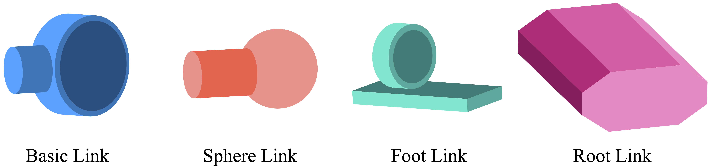
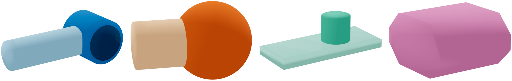
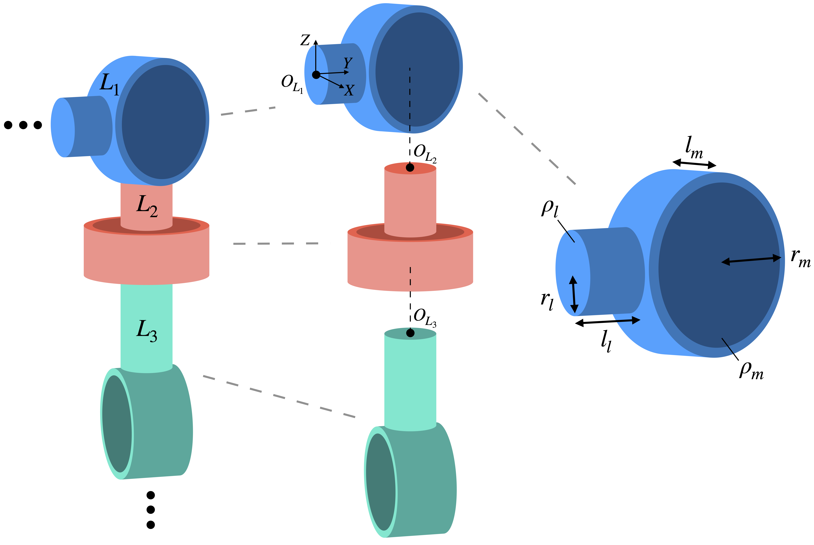
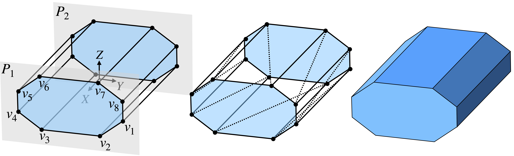

# Robot format

A robot is a directory; the engine (`src/draft/generation/`) compiles it into a
checked MJCF. Nothing robot-specific lives in Python.

```
src/draft/robots/<name>/
  parameters.yaml   flat table of numbers: lengths, ranges, motor classes, colours
  tree.yaml         kinematic tree; any numeric field may be a ${expr} over the table
  mesh.yaml         optional: root body as stacked cross-sections, lofted to an STL
  modules/*.xml     optional: subtrees that are real MJCF files, attached by `module:`
```

Every directory with `parameters.yaml` + `tree.yaml` is discovered by
`scripts/generate_robot.py`, the editor and the task registry. Values the trends own are in
[fitted-trends.md](fitted-trends.md); where each number comes from, in
[provenance.md](provenance.md).

## Generating

```bash
python scripts/generate_robot.py --robot quadruped                                   # generated/quadruped_<timestamp>/
python scripts/generate_robot.py --robot humanoid --output-dir generated/h --fixed-output-dir
python scripts/generate_robot.py --robot quadruped --overrides experiments/quadruped_variants/bear.yaml
```

From Python: `draft.generation.generator.RobotGenerator(robot_dir).generate(out_dir,
params_override={...})`. An override file is a partial `parameters.yaml`; that is
all a design variant is. Output: `<robot>.xml`, `scene.xml` (robot + floor +
light), `feasibility_report.yaml`, `parameters_resolved.yaml`, and with a mesh
`<name>_mesh.stl` + `<name>_inertial_properties.yaml`.

Order: load → size motor classes → expand `*_mot` → resolve `${}` and `for_each`
→ expand `mirror_of` → prune `<role>_dof: false` → loft mesh → build `MjSpec`,
attach modules, compile → gates → write. A gate failure raises
`FeasibilityViolation` and writes nothing.

## `parameters.yaml`

A flat mapping of scalars, lists, `"R G B A"` colours, or `${expr}` strings.

### Motor classes

A class is a name prefix (`L`, `M`, `S`, or any other) with these **inputs**:

| key | meaning |
|---|---|
| `<cls>_motor_effort` | peak torque [N·m] |
| `<cls>_motor_velocity` | no-load speed [rad/s] |
| `<cls>_motor_gear` | reduction |
| `<cls>_motor_power` | peak power, catalogue convention `τ·ω/4` [W] |
| `<cls>_motor_mode` | which two of the above are stated (below); default `torque_speed` |
| `<cls>_motor_aspect` | `L/D` of the package; default is the catalogue's split at this torque and reduction |
| `<cls>_motor_friction`, `_damping` | asserted gearbox losses (no trend covers them) |
| `_<cls>_motor_catalog` | anchor on a catalogued part (e.g. `AK80-64`); the trend charges only the deviation. State the reduction too. |

| mode | stated | solved |
|---|---|---|
| `torque_speed` | `effort`, `velocity` | `gear` from the speed trend, if not given |
| `torque_gear` | `effort`, `gear` | `velocity` |
| `power_gear` | `power`, `gear` | `velocity`, then `effort` |
| `power_torque` | `power`, `effort` | `velocity` |

`<cls>_motor_r`, `_L`, `_rho`, `_armature`, `_mass` are **outputs**: a value for
them, or for whatever the mode derives, is ignored and listed under
`overridden_by_law`. A joint takes a class through a key ending `_mot`, and the
derived keys are then usable in expressions (`${knee_motor_r * 0.9}`):

```yaml
hip_pitch_mot: L      # adds hip_pitch_motor_{r,L,effort,velocity,friction,damping,armature,rho}
knee_mot:      M
```

### Population, densities, placement

| key | meaning |
|---|---|
| `mass_composition_reference` | `humanoid` or `quadruped`: the measured population every mass band comes from. Omit to skip the mass-composition audit. |
| `size_metric_expr` | length for the mass-vs-size check. Humanoid default: joint-frame z-span; a quadruped should state thigh + shank. |
| `head_rho`, `hand_rho`, `foot_rho`, `thigh_rho`, `shank_rho`, `upper_arm_rho`, `forearm_rho`, `torso_rho` | declare that the body exists; the value is replaced by the population median when a reference is set |
| `link_mass_class` (tree geometry key, required on every structural member) | the member's segment — a body with a joint plus its jointless children — weighs its class's structural trend `m = cL^e` at the segment's joint-to-joint length (between the joint AXES where they are parallel, so an anchor slid along its own axis changes nothing; beyond the class's fitted length range the mass per metre is held at its value at the range edge rather than extrapolated), shared among its members by length, with any sphere in the segment paid first. Radius is solved at the class's effective density, never wider than the actuators the member joins (radius when coaxial, min(r, L/2) when broadside); where that cap binds the density is raised instead, so mass and inertia are kept. Floored at 5% of the target when the sphere alone exceeds it. Reported under `structural_links`; a member without a class is warned about |
| `link_r_max` (tree geometry key, optional) | a further bound on the structural radius |
| `link_render_radius_scale` | draw members thinner than their structural radius; density is scaled by `(r_struct/r_drawn)²`, so no mass moves |
| `shoulder_motor_inset` | humanoid: fraction (≤ 0.5) of the shoulder-pitch actuator inside the trunk wall |
| `hip_roll_inset` | quadruped: how far inboard of the trunk end wall the hip-roll axis sits [m] |
| `hip_width` | humanoid: span between hip-pitch axes |

### Gate switches

| key | effect |
|---|---|
| `allow_hypothetical: true` | a class past the catalogued frontier warns instead of raising |
| `allow_motor_overlap: true` | actuator-vs-actuator packing warns instead of raising |
| `packing_exempt_geoms: [...]` | geoms that are one actuator drawn twice (e.g. a belt pulley) |
| `structure_overlap_allowed: [role, ...]` | roles (or module geom names) allowed inside the root mesh |
| `allow_actuator_in_structure: true` | any solid inside the root mesh warns instead of raising |
| `link_motor_inset: false` | members run joint-to-joint instead of stopping at the actuator face |
| `link_motor_penetration` | bolt-flange overlap kept at each inset end [m], default 0.005 |
| `<role>_dof: false` | remove joint `*_<role>` and its actuator; the structural link stays |
| `geom_friction`, `geom_solimp`, `geom_solref` | model-wide contact defaults, as MuJoCo strings |

## `tree.yaml`

The top node is the root. Every node has `name` and `type`, plus:

| key | meaning |
|---|---|
| `pos`, `euler` | body origin in the parent frame; optional rotation [rad] |
| `joint` | `{name, axis, range, motor_class}`, `axis` one of `x y z -x -y -z`. Omit or `null` for a rigid body. Always a hinge. |
| `geometry` | per-type keys below |
| `sites` | `[{name, pos}]` |
| `children` | child nodes, `mirror_of` entries, `for_each` blocks |

`joint.motor_class` sets the joint's limits (peak torque → `actuatorfrcrange`;
damping, friction, armature). `geometry.motor_class` sets the actuator the body
draws at its tip, which drives the **child** joint. The two often differ.

`${expr}` is evaluated with only `pi abs min max sqrt len round`, the helpers
`mount_pos mount_euler edge_point edge_outward_normal rect_outline`, and any
`for_each` variable. A string that is exactly `${...}` keeps its type (float,
list); otherwise each `${...}` is substituted in. Quote it inside a YAML flow
list: `pos: ["${torso_lx / 2}", 0, 0]` (unquoted is a parse error).

### Link primitives



The same four, as the paper's Fig. 2 draws them — each plate is a real generated
model, rendered by `scripts/figures/fig2_link_primitives.py`:



| `type` | draws | required geometry |
|---|---|---|
| `root` | free joint + lofted mesh from `mesh.yaml` (without one it has no mass and will not compile) | none |
| `basic` | structural cylinder + actuator at its tip + weightless detail ring | `link_axis`, `link_l`, `link_mass_class` (or a stated `link_r`/`link_rho` outside a measured population), `motor_axis`, `motor_class` |
| `sphere` | structural cylinder + sphere at one end | `link_axis`, `link_l`, `link_mass_class` (or a stated `link_r`), `sphere_r` |
| `foot` | riser + sole plate + 5 contact sites | `foot_l`, `foot_w` |
| `geom` | one raw primitive | `shape`, `r` (+ size keys) |

#### `basic`



```yaml
- name: left_upper_leg_link
  type: basic
  pos: [0, 0, "${-lower_hip_link_length}"]
  joint: {name: left_hip_yaw, axis: z, range: "${hip_yaw_range}", motor_class: "${hip_yaw_mot}"}
  geometry:
    link_axis:   -z                                     # direction the member extends
    link_l:      ${upper_leg_link_length}               # joint-to-joint length
    link_mass_class: thigh                              # radius solved from the thigh λ trend
    link_r_max:  ${knee_motor_r}                        # never wider than the actuator it houses
    motor_axis:  y
    motor_class: ${knee_mot}
    motor_for:   knee                                   # role this actuator drives (packing gate)
```

| optional key | meaning |
|---|---|
| `link_rho`, `link_color`, `link_render_r` | per-link density, colour, pinned drawn radius |
| `motor_r`, `motor_L`, `motor_rho` | override the drawn actuator; `motor_rho: 0` draws one already charged elsewhere |
| `motor_offset` | pull the actuator back along the link toward the parent [m] |
| `motor_shift` | translate the actuator perpendicular to the link `[x, y, z]` |

The actuator is centred on the link tip (recessed by `L/2` when coaxial); the
member stops at the actuator faces plus the bolt flange. `link_l: 0` makes the
body only its actuator, a housing bolted to the parent.

#### `sphere`, `foot`, `geom`

| type | key | default | meaning |
|---|---|---|---|
| sphere | `sphere_dir` | `1` | `+1` sphere at the positive end of `link_axis`, `-1` the negative |
| sphere | `sphere_color`, `sphere_rho` | link's | a sphere named `*head*`/`*hand*` is charged to that role |
| sphere | `friction` | model default | `[slide, spin, roll]` for this sphere only |
| foot | `foot_l`, `foot_w` | required | sole plate footprint |
| foot | `foot_h` | `0.025` | ankle joint to sole, the whole envelope including ankle hardware |
| foot | `foot_plate_h` | `0.015` | plate thickness |
| foot | `foot_offset_x` | `0.03` | plate offset forward of the joint |
| foot | `foot_rho` | `link_rho` | charged on `foot_l × foot_w × foot_h`, not on the plate |
| foot | `riser_r`, `riser_color`, `color` | ankle class | drawing |
| geom | `shape` | `cylinder` | `sphere`, `cylinder`, `capsule`, `box` |
| geom | `r`, `l`, `axis` / `fromto` | | cylinder or capsule size |
| geom | `lx`, `ly`, `lz` | `r` | box extents |
| geom | `rho` / `mass` | `motor_rho` | density or explicit mass |
| geom | `role` | `other` | mass role for the audit |
| geom | `decorative` | `false` | `true`: weightless and non-colliding (eyes, bezels) |

The foot's weightless riser runs down `max(foot_h − foot_plate_h, ankle motor
radius)`. Sites `<name>_sphere_0..3` mark the sole corners, `<name>_toe_sphere` the toe.

### Mirror, sites, sensors

```yaml
children:
  - name: left_upper_hip_link
    # ... full subtree ...
  - {name: right_upper_hip_link, mirror_of: left_upper_hip_link, mirror_axis: y}
```

The source must come earlier in the same list. The copy negates `pos`, site
positions, `motor_shift` and the `link_axis`/`motor_axis` component along the
mirror axis, and swaps prefixes `left_↔right_`, `fl_↔fr_`, `rl_↔rr_`, `bl_↔br_`.
**Joint axes and ranges are not mirrored**: a positive angle means the same
motion on both sides, so write the left/front side. `sites` may go on any node;
`sensors` on the root:

```yaml
sensors:
  - {type: gyro,          name: imu_ang_vel, site: imu}
  - {type: subtreeangmom, name: root_angmom, body: torso_link}
```

### `for_each`, `module:`, `tree.py`

These exist for a morphology layer above the shipped robots, none of which use them.

```yaml
children:
  - for_each: ${fingers}               # any expression yielding a list
    as: f                              # item name, default `item`
    where: ${f.dof_type == '3dof'}     # optional filter: the only branching the format has
    node:
      name:   ${f.name}
      module: modules/finger_3dof.xml  # an ordinary MJCF model, relative to the robot dir
      pos:    ${mount_pos(palm_polygon, f)}
      joints: {mcp: F, pip: F, dip: F} # class torque limit, armature, damping, friction
      motors: {proximal_motor: F}      # geoms resized to the class envelope
      roles:  {tip: link}              # mass role per geom (*_motor, *_link automatic)
      set:                             # <kind>.<name>.<attr>, kind = body|geom|joint|site
        geom.proximal_link.size: ["${finger_link_r}", "${f.proximal_l / 2}"]
```

`${f.<field>}` reads the item, `${f_index}` its position; nested loops see both.
`mount_pos(polygon, spec)` returns `[0, y, z]` on edge `spec.palm_edge` (slide
with `palm_edge_t`) and `mount_euler` the roll onto its outward normal; a spec
may give `palm_pos_y`, `palm_pos_z`, `exit_angle` instead. Module names get
`prefix` (default `<name>_`); a joint left out of `joints:` is unactuated and
warns; module meshes are copied beside the output; assembly contact defaults are
stamped on module geoms before `set:`; `<role>_dof: false` does not reach inside.
A `tree.py` defining `get_tree(params) -> dict` overrides `tree.yaml` and
returns the resolved structure; the root may set `density_param`.

## `mesh.yaml`



```yaml
name:          torso        # writes torso_mesh.stl
axis:          z            # sections stack along this axis
density_param: torso_rho
chamfer:       0.15         # default corner chamfer for lx/ly sections
layers:
  - {pos: "${-torso_length}", lx: "${torso_lx}",       ly: "${torso_ly}"}
  - {pos: 0,                  lx: "${shoulder_depth}", ly: "${shoulder_width}", cx: "${lean}"}
  - {pos: "${torso_cap}",     polygon: "${torso_outline}", inset: "${bevel}"}
```

A layer is `lx`, `ly` (+ `cx`, `cy`, `chamfer`): a chamfered rectangle, or
`polygon: [[u, v], ...]` (+ `inset`, pulled inward). In-plane axes follow the
loft axis: `x` → (u, v) = (Y, Z), `y` → XZ, `z` → XY. All layers need the same
vertex count; a bevelled end is an `inset` layer plus the full outline just
inside it. `rect_outline(lu, lv, chamfer, cu, cv)` builds an outline parameter.
A non-loft shape can be a `mesh.py` subclass of
`draft.generation.root_mesh.RootMesh`, used when no `mesh.yaml` exists.

## The emitted model

- Radians, `autolimits`, timestep 0.002, Newton. Inertia comes from geom shape
  and density; the root's from its mesh. Geoms collide with friction
  `0.7 0.1 0.1`; class `visual` never collides. Joint damping default 0.01.
- **No `<actuator>` block.** Peak torque is the joint's `actuatorfrcrange`,
  no-load speed the numeric `<joint>_velocity_limit`; the controller is the
  consumer's.
- Written at 6 significant figures; `feasibility_report.yaml → xml_roundtrip`
  records the drift.

## Minimal example

A one-legged hopper. `hip_link` is a jointless `basic` with `link_l: 0`,
because a body draws its child's actuator and the root cannot.

`parameters.yaml`
```yaml
L_motor_effort:   50.0
L_motor_velocity: 20.0
L_motor_gear:     9.0
L_motor_friction: 0.05
L_motor_damping:  0.005
link_rho:          500.0
link_radius_scale: 0.9
hip_mot:  L
knee_mot: L
hip_range:  [-2.0, 2.0]
knee_range: [0.0, 2.5]
thigh_length: 0.22
shin_length:  0.20
foot_sphere_r: 0.025
body_lx: 0.12
body_ly: 0.10
body_lz: 0.06
link_color:       0.5 0.5 0.8 1.0
motor_color:      0.3 0.3 0.5 1.0
mot_detail_color: 0.1 0.1 0.2 1.0
torso_color:      0.5 0.5 0.8 1.0
foot_color:       0.3 0.3 0.6 1.0
```

`mesh.yaml`
```yaml
name: torso
axis: z
density_param: torso_rho
layers:
  - {pos: "${hip_motor_r + 0.01}",           lx: "${body_lx}", ly: "${body_ly}"}
  - {pos: "${hip_motor_r + 0.01 + body_lz}", lx: "${body_lx}", ly: "${body_ly}"}
```

`tree.yaml`
```yaml
name: torso_link
type: root
color: ${torso_color}
pos: [0, 0, "${thigh_length + shin_length + foot_sphere_r}"]   # standing height; floor is z = 0
sites:   [{name: imu, pos: [0, 0, 0]}]
sensors: [{type: gyro, name: imu_ang_vel, site: imu}]
children:
  - name: hip_link
    type: basic
    pos: [0, 0, 0]
    geometry: {link_axis: -z, link_l: 0, motor_axis: y, motor_class: "${hip_mot}", motor_for: hip}
    children:
      - name: thigh_link
        type: basic
        pos: [0, 0, 0]
        joint: {name: hip, axis: y, range: "${hip_range}", motor_class: "${hip_mot}"}
        geometry: {link_axis: -z, link_l: "${thigh_length}", link_r: "${knee_motor_r * link_radius_scale}",
                   motor_axis: y, motor_class: "${knee_mot}", motor_for: knee}
        children:
          - name: shin_link
            type: sphere
            pos: [0, 0, "${-thigh_length}"]
            joint: {name: knee, axis: y, range: "${knee_range}", motor_class: "${knee_mot}"}
            geometry: {link_axis: -z, link_l: "${shin_length}", link_r: 0.015,
                       sphere_dir: -1, sphere_r: "${foot_sphere_r}", sphere_color: "${foot_color}"}
            sites: [{name: foot, pos: [0, 0, "${-shin_length}"]}]
```

Nothing declares parameter bounds: sweep with `params_override` and read the
verdict from `feasibility_report.yaml`.
