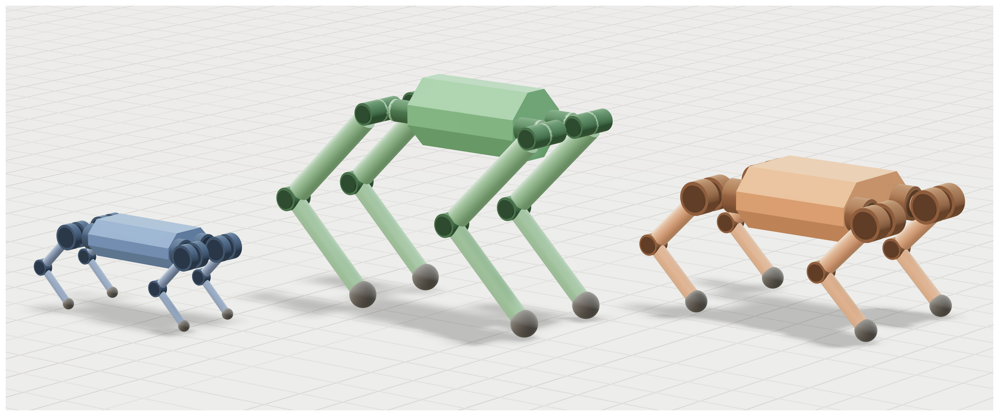
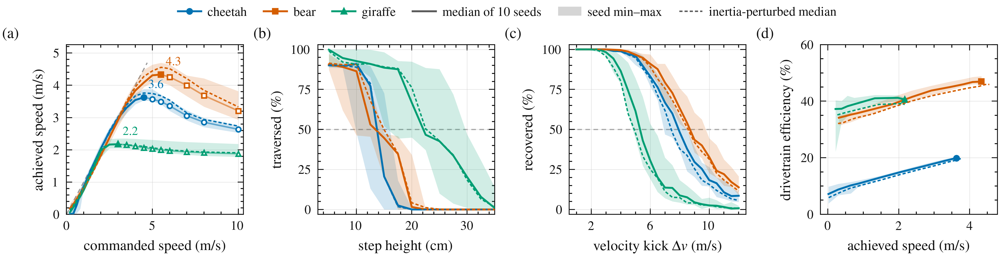

# Quadruped RL tasks



*Three designs from one specification, at true relative size.*



*Capability in absolute units. Lines are medians over ten seeds, bands span
min to max, dashed lines are the same policies on builds carrying the inertia
error the twins measured.*

```shell
python scripts/generate_quadrupeds.py --only cheetah   # the robot every task config names
python scripts/train.py --task quadruped               # flat-ground base policy
python scripts/train.py --task quadruped_terrain \
    --warmstart logs/quadruped_flat/<timestamp>_quadruped_flat/model_999.pt
python scripts/play.py  --task quadruped --viewer native
```

Every task logs to Weights & Biases and uploads its checkpoints, so run
`wandb login` once, or `export WANDB_MODE=offline` to keep the logs local.

- Tasks are registered in `src/draft/tasks/tasks.yaml`. Each points at a package
  exposing `make_env_cfg(play=False, **kwargs)`, `make_runner_cfg()` and a
  `config.yaml`; `train.py` needs no edit to add one.
- `quadruped_push`, `quadruped_terrain` and `quadruped_velocity` each add one
  curriculum on the same observation and action space as the flat base, so they
  warm-start from it and each curriculum's endpoint reads as a capability.
- The robot a task trains on is the run config's `env_kwargs.robot_xml`. To
  train another design, copy the config and change that line.
- Gait rewards are Froude-scaled by leg length, and PD gains scale with each
  joint's peak torque, so designs of different size are compared fairly.
- Terrain mixes are named in `base_env.py:TERRAIN_MIXES`. Two robots being
  compared must use the same mix.
- `task_geometry_xml` scores a pair of robots on a task defined by the same
  machine, so a twin/original comparison measures the robot, not the task.

## Inertia-mismatch evaluation

A generated design's inertias are predictions. `scripts/make_twins.py` measures
how wrong they are on the two quadruped twins, per anatomical group, and writes
`experiments/twin_inertia_mismatch.json`. The evaluator's `--dr-inertia` draws
each replica's link inertias from that range, with no retraining:

```shell
python -m draft.lineup.evaluate --robot cheetah --battery speed --dr-inertia \
    --checkpoint logs/<run>/<ts>/model_<it>.pt
```

`scripts/train_all.py evaluate` runs every design this way as the sweep's
perturbed arm.

- The range is not centred on 1.0, because the measured error is not: both
  quadruped twins under-weight the trunk and over-weight the shank.
- One draw per group per replica, shared across all four legs.
- Quadruped twins only; humanoids have the opposite shank bias.
