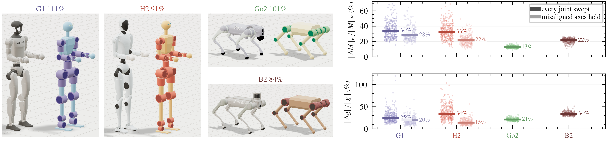

# Digital twins

A twin is a robot generated by Draft from what a vendor's published description
states about geometry and actuation, then scored against that description's
masses and dynamics. It tests whether the fitted trends
([fitted-trends.md](fitted-trends.md)) compose into a whole robot. Four Unitree
platforms are in the set: G1 and H2 (humanoids), Go2 and B2 (quadrupeds). The
code is `src/draft/twins/`; vendor descriptions are fetched, not committed
([fetching-robots.md](fetching-robots.md)).

## What crosses over

| tier | what | rule |
|---|---|---|
| design brief | joint placements and axes; per-segment inertia-equivalent box and geometric envelope; trunk cross-section; humanoid foot, hand and head size; per-joint peak torque and no-load speed; DOF topology | **copied** |
| prediction | every mass, inertia, COM, actuator envelope, density | **never copied**: derived by the trends |
| unmeasured | armature, damping, frictionloss | **matched** across the pair in the RL adapter, originals recorded |

No mass, density, inertia or armature crosses. The gear ratio is not published,
so it is inferred per joint by inverting the fitted speed trend. The test is not
fully held out: G1 is excluded from the density fit, but H2, Go2 and B2 are in
the 49-robot population ([robot-dataset.md](robot-dataset.md)) and Go2's joint
module is in the actuator catalogue ([actuator-dataset.md](actuator-dataset.md)).
Leave-one-out remains the held-out evidence; the twins test composition.

## Commands

```bash
python scripts/make_twins.py                         # all four targets, all steps
python scripts/make_twins.py --only g1 go2           # some targets
python scripts/make_twins.py --steps build           # build | adapt | inertia | render
python scripts/figures/fig5_twin_dynamics.py         # the paper figure
pytest --runslow tests/test_twins.py                 # rebuilds all four and pins the ratios
```

`generated/twins/<key>/` holds the twin model and reports, `twin_overrides.yaml`
(the parameters derived from the target), `twin_solve.yaml` (fixed-point
corrections), `measurements.json` (both robots under one schema) and
`shipped_rl/` (the adapted vendor model). `index.json` summarises all four.

## Results



*Left: vendor and twin together, with the twin's mass ratio. Right: inertia
(top) and gravity (bottom) error over 300 configurations per pair.*

### Total mass

| robot | DOF vendor → twin | vendor | twin | twin ÷ vendor |
|---|---|---|---|---|
| Unitree G1 | 29 → 29 | 33.3 kg | 37.2 kg | **1.115** |
| Unitree H2 | 31 → 29 | 75.6 kg | 68.7 kg | **0.909** |
| Unitree Go2 | 12 → 12 | 16.1 kg | 16.3 kg | **1.011** |
| Unitree B2 | 12 → 12 | 74.6 kg | 62.7 kg | **0.841** |

All four inside ±25%, geometric mean fold error **1.10×**. The error has no
single sign (G1 and Go2 heavy, H2 and B2 light), so no twin is a bound on its
vendor's mass. Every structural member is sized by the population trend, as for
any generated design. H2's twin needed `allow_hypothetical`
(`law_relaxed` in `index.json`): its declared ankle-roll limits place it past the
catalogued frontier.

### Per segment

Twin ÷ vendor mass per anatomical group, one limb (a body belongs to the group of
the joint that drives it):

| group | G1 | H2 | Go2 | B2 |
|---|---|---|---|---|
| trunk | 1.04 | 0.85 | **0.99** | **0.74** |
| hip link | 1.22 | 1.98 | 0.98 | 0.88 |
| thigh | 1.73 | 0.71 | 1.02 | 0.98 |
| shank | 0.55 | 0.46 | 1.20 | **1.43** |
| ankle link | 11.99 | 5.31 | | |
| foot | 0.28 | 0.38 | | |
| shoulder link | 1.09 | 1.05 | | |
| upper arm | 0.85 | 3.42 | | |
| forearm | 1.58 | 0.78 | | |
| wrist link | 1.11 | 0.68 | | |
| hand | 1.04 | 0.45 | | |
| **GMFE** (excl. ankle link) | 1.42 | 1.76 | 1.06 | 1.23 |

- **Go2:** the trunk, hip link and thigh land within 2%; the residual is a calf
  heavier than Unitree's (120%).
- **B2:** the thigh lands at 98% and the hip link at 88%, the calf is heavy
  (143%), and the trunk is at 74%. B2's own trunk measures **986 kg/m³**
  against the surveyed quadruped median of **654**, a property of that machine
  that a median-based trend should not reproduce.
- **Ankle link** is a grouping artifact: the tree hangs a whole ankle-roll
  actuator on the ankle link, where the vendors put the mass in the foot.
  Ankle link and foot together are the comparable quantity.

Quadruped mass distribution (`inertia_mismatch.py`, vendor ÷ twin):

| group | Go2 mass | Go2 k_gyr | B2 mass | B2 k_gyr |
|---|---|---|---|---|
| trunk | 1.01 | 1.14 | 1.36 | 1.14 |
| hip link | 1.02 | 1.11 | 1.14 | 0.83 |
| thigh | 0.98 | 1.17 | 1.02 | 1.16 |
| shank | 0.83 | 1.19 | 0.70 | 1.58 |

These ranges, stored in `experiments/twin_inertia_mismatch.json`, are what the
inertia-perturbed evaluation draws from ([`tasks.md`](tasks.md)).

### Dynamics

`dynamics_parity.py` puts both robots in the same state (joints matched, base
fixed, zero velocity) at 300 configurations drawn from the overlap of their
joint limits, with the rotor term off on both sides (only G1 publishes a
per-joint armature).

| | Go2 | B2 | G1 | H2 |
|---|---|---|---|---|
| median ‖ΔM‖_F / ‖M‖_F | 12.8% | 21.7% | 33.9% | 32.6% |
| median ‖Δg‖ / ‖g‖ | 21.4% | 34.1% | 25.2% | 34.1% |
| misaligned axes held still: M | | | 28.4% | 21.9% |
| misaligned axes held still: g | | | 19.6% | 14.5% |

Axis placement is the largest single cause. Both quadruped twins reproduce all
12 joint axes; G1 misses 6 of 29 by up to 16° (shoulder pitch is canted in G1's
own URDF) and H2 misses 4 by up to 30° (hip pitch, `rpy="-0.5236 0 0"`). Mass
composes to within 25% on all four; dynamics only where the link vocabulary
reaches the target's axes.

### Kinematics

Per body, in each robot's root frame, at `q = 0` after adaptation:

| pair | mean ‖Δ‖ | worst body | worst axis agreement (\|cos\|) |
|---|---|---|---|
| G1 | 30 mm | 75 mm (pelvis) | 0.961 (shoulder pitch) |
| H2 | 45 mm | 112 mm (foot) | 0.866 (hip pitch) |
| Go2 | 18 mm | 29 mm (calf) | 1.000 |
| B2 | 40 mm | 65 mm (calf) | 1.000 |

Hip-roll→knee and knee→ankle spans, hip-pitch spacing and roll-axis widths land
on the measurement: packing floors are absorbed by the adjacent segment, not by
moving joints.

## Known structural limits

- **Nested hip actuators (quadrupeds).** Go2 and B2 share volume between the
  abduction and hip-pitch units (hip-body COM 5.1 mm and 9.6 mm from the roll
  axis). The tree draws non-intersecting cylinders, so the units are separated
  fore-aft and the mass lands 64 mm (Go2) / 93 mm (B2) ahead of where it
  belongs. Kinematics stay exact. This is the hip-link COM error.
- **Quadruped leg offset.** Unitree places the lateral offset between roll and
  pitch axes; the tree places it between pitch and knee. The leg plane matches,
  and the knee sits about 22 mm high.
- **Quadruped trunk shape.** The trunk's length is pinned by the hip-roll
  actuators, and its section is scaled until the inertia-box volume equals the
  vendor's. Trunk mass is right, but the body is short and wide: 0.74× the
  vendor's length and about 1.2× its width and height.
- **Humanoid hip drop.** The tree lays the hip pitch→roll offset out laterally
  and loses its vertical part (G1 30.5 mm, H2 48.2 mm), so the twins stand
  shorter. Recorded as `hip_drop`.
- **Packing floors.** Where actuators would intersect, a cluster link is
  lengthened (`separation_floors_m` in `index.json`; up to 180 mm on H2's
  `lower_hip_link_length`).
- **Joints the tree lacks.** H2's 2-DOF neck is welded. Removal is possible
  (`<role>_dof: false`); addition is not.
- **Closed loops.** H2 drives knees, ankles and waist through linkages; the twin
  uses direct drives, and H2's adapted model is built from its tree-structured
  URDF.
- **Hands** are a palm of the measured volume, with 0.38× the vendor's reach.
- **Joint ranges** are not predicted. Anything expressed as an absolute joint
  angle (nominal stance, limit penalties) couples the pair; `default_stance()`
  clamps the crouch into each robot's own range.
- **Vendor armature** is one flat value per model on G1 (`g1.xml`) and Go2, and
  absent on H2 and B2, while the twin derives `N²·J` per joint.

## Sources and selection

| platform | mass and torque from | geometry and render from |
|---|---|---|
| G1 | `unitree_ros` `g1_29dof_rev_1_0.urdf` | menagerie `unitree_g1/g1_mjx.xml` |
| H2 | `unitree_ros` H2 URDF | same URDF (the MJCF is closed-loop) |
| Go2 | `unitree_ros` `go2_description.urdf` | menagerie `unitree_go2/go2.xml` |
| B2 | `unitree_ros` `b2_description.urdf` | `b2_description_mujoco/xml/b2.xml` |

A platform is in only with (a) an official description with real effort and
velocity limits and (b) a maintained MuJoCo model. Excluded: Spot, Mini Cheetah,
Solo, Barkour (effort column absent or placeholder), Atlas (hydraulic), AgiBot X1
(CAD only). ANYmal C stays in the fit population but not in the twin set.

## Vendor models in the RL environment

`make_twins.py --steps adapt` renames a vendor model into the env's contract (body, joint,
site and sensor names, `<joint>_velocity_limit` numerics, `forcerange` from
URDF effort) and leaves masses, inertias, lengths, limits and meshes untouched.
It pairs joints by measured axis direction, fixes axis signs, aligns the rest
pose positionally (`zero_align.py`), normalises root orientation, slides the
`torso_link` origin onto the twin's (`root_origin_shift_m`), and reroots
humanoids from `pelvis` to `torso_link` (`reroot.py`, FK-verified). The
mass-matrix and gravity comparison of Fig. 5 reads these adapted models.

## Modules

| module | job |
|---|---|
| `targets.py` | registry: description paths, joint→role maps, selection notes |
| `measure.py` | one measurement schema for target and twin: joints, groups, features, trunk section fit |
| `synthesize.py` | measurement → parameter overrides → twin, as a fixed point (`build_twin`) |
| `dynamics_parity.py` | M(q), g(q) and per-link agreement against the target |
| `inertia_mismatch.py` | per-group mass, radius of gyration and COM error (quadrupeds) |
| `inertia_perturb.py` | applies that error to a lineup design for the inertia-mismatch arm |
| `render.py`, `viser_render.py` | side-by-side plates, one scene and one camera; `PairRenderer.prepare` decides which solids are drawn |
| `rl_adapter.py`, `rl_adapter_humanoid.py` | vendor model → RL env naming contract |
| `zero_align.py` | rest-pose alignment by joint position |
| `reroot.py` | move the floating base to another body |
